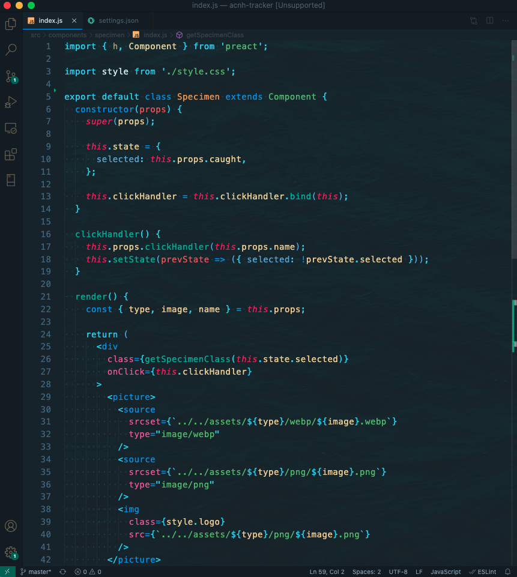

# 🌊 Ocean Code - VS Code Theme 🌊

## Installation 🐠
You can install this theme from the [VS Marketplace](https://marketplace.visualstudio.com/items?itemName=Sharktopus.ocean-code).

## Preview 🐳


## Background 🐡
The water background isn't part of the theme that you can get on the marketplace - but if you want it, follow these steps:
* Install the [`background`](https://marketplace.visualstudio.com/items?itemName=shalldie.background) extension.
* Add these settings to your VS Code `settings.json` file:

  ```json
    "background.enabled": true,
    "background.useDefault": false,
    "background.customImages": [
      "https://images.unsplash.com/photo-1550940934-bc02c7c59618?ixlib=rb-1.2.1&ixid=eyJhcHBfaWQiOjEyMDd9&auto=format&fit=crop&w=1050&h=2100&q=100"
    ],
    "background.style": {
      "content": "''",
      "pointer-events": "none",
      "position": "absolute",
      "z-index": "99999",
      "width": "100%",
      "height": "100%",
      "background-position": "center",
      "background-repeat": "no-repeat",
      "background-size": "100%,100%",
      "opacity": 0.10
    },
  ```

Then you'll be prompted to restart VS Code, and the background should appear. If not, take a look at the `background` extension documentation.

## Thanks 🐙
* Couldn't have done anything without this [CSS-Tricks Article](https://css-tricks.com/creating-a-vs-code-theme/) - thanks Sarah Drasner!
* For a long time, I used the [Dark Sea](https://marketplace.visualstudio.com/items?itemName=MoOx.dark-sea) theme, but decided that I wanted a little more color - so I made this!

**Enjoy!** 🦀
